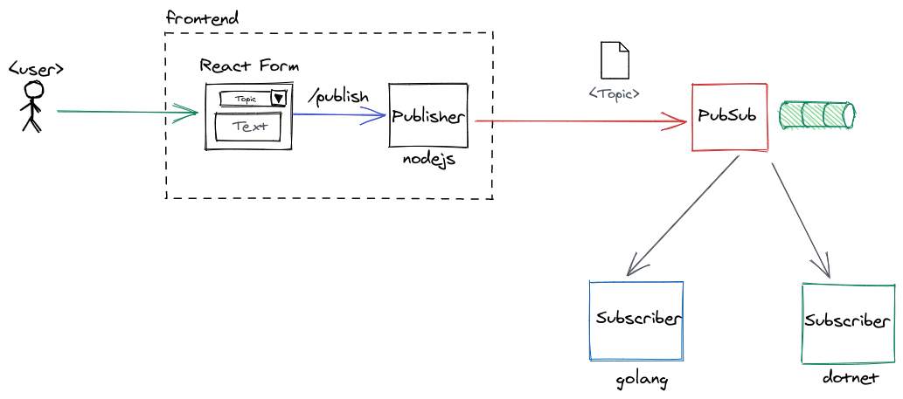
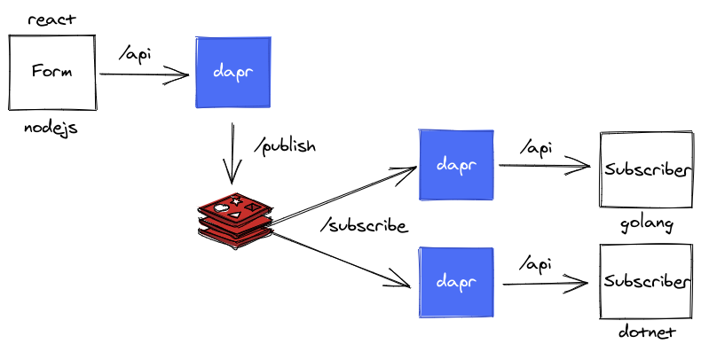
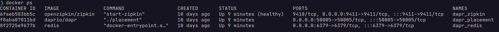
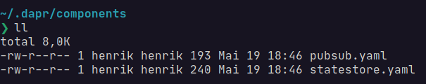
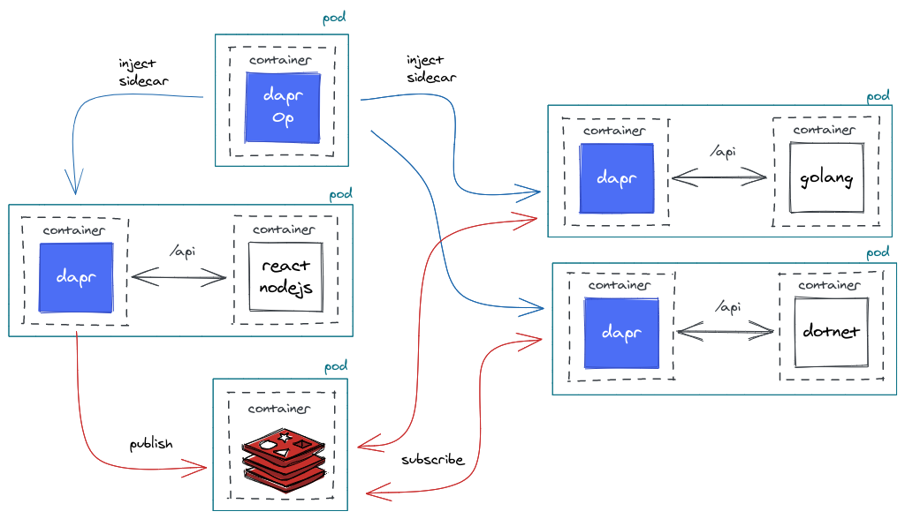
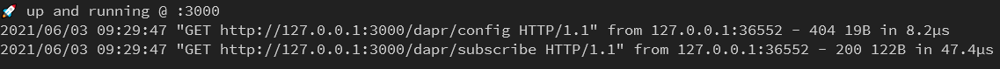
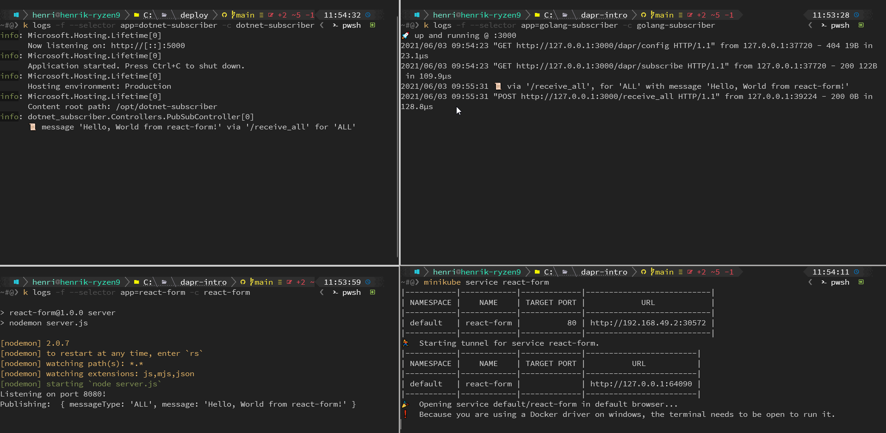
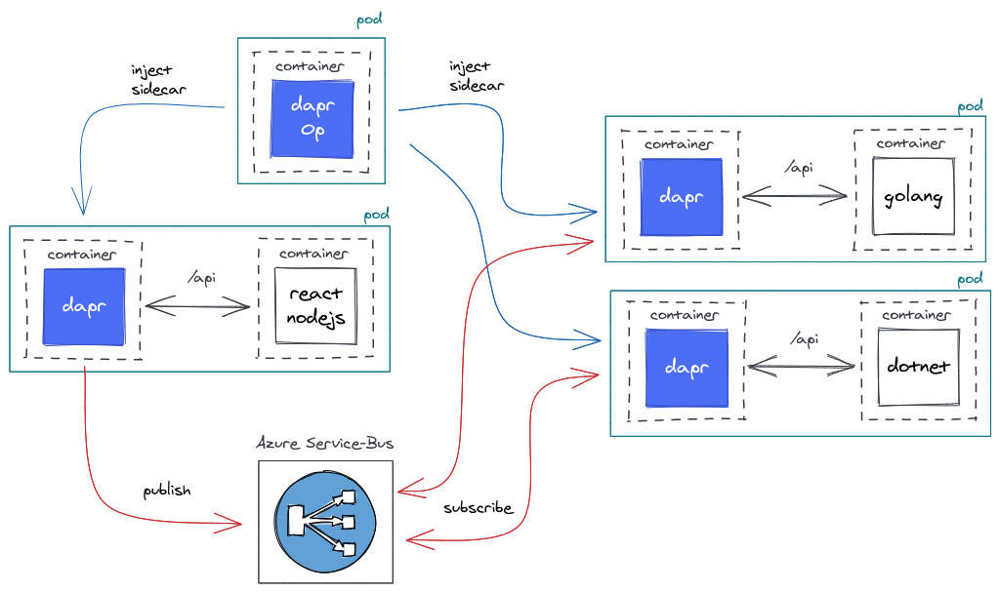
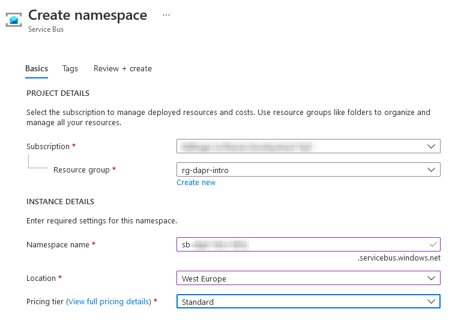

# dapr pub-sub example
This repo is just a copy of the original [dapr](https://github.com/dapr/dapr) pubsub quickstart [sample](https://github.com/dapr/quickstarts/tree/master/pub-sub).

The only changes are, that a [golang](https://golang.org/) and a [.NET](https://dotnet.microsoft.com/) subscriber are used (instead of the "original" nodejs, pyhton ones) and that [redis](https://redis.io/topics/streams-intro) can be swapped out with [Azure Service Bus](https://azure.microsoft.com/en-us/services/service-bus/).

**TL;DR;**

In a nutshell a **react form** publishes a message via an **nodejs/express** app to a pubsub component. Two subscribers one **golang** one **dotnet** react based on topics to the messages received through the subscription.



# Setup
For the examples to work, the following software components need to be installed:

- dapr (1.x) - https://docs.dapr.io/getting-started/install-dapr-cli/
- golang (1.16.x) - https://golang.org/dl/
- dotnet (5.x) - https://dotnet.microsoft.com/download
- nodejs (14.x) - https://nodejs.org/en/download/
- docker (20.x) - https://docs.docker.com/get-docker/
- mininkube, kubectl (1.20.x) - https://kubernetes.io/docs/tasks/tools/

On Windows, best provided via scoop (https://scoop.sh/)

For k8s/minikube follow these steps to enalbe [dapr for k8s](https://github.com/dapr/quickstarts/tree/master/hello-kubernetes) including the deployment of [redis](https://docs.dapr.io/getting-started/configure-state-pubsub/#create-a-redis-store) as a store and pubsub component.

# dapr CLI
Each of the 3 components (react-form, golang-subscriber, dotnet-subscriber) has a Makefile which can be used to compile the apps and run them via dapr cli.

e.g. dotnet-subscriber

```
make dapr-run
```

Open seperate terminals and change to the respectice directories and start the app via the dapper cli.

**HINT**:

If on windows without proper Makefile support just execute the command manually:

```
dapr run --app-id dotnet-subscriber --app-port 5000 ./output/dotnet-subscriber
```



Open the react-form in a browser and send messages to the different topics and see the result in the output of the applications.

**Hint:**

Where is the redis pubsub component when using dapr cli? If you install dapr a local redis container is deployed and the dapr component configured.



The configuration for dapr cli can be found in the local dir: ```~/.dapr```



The pubsub component is the same as later used with k8s.

```yaml
apiVersion: dapr.io/v1alpha1
kind: Component
metadata:
  name: pubsub
spec:
  type: pubsub.redis
  metadata:
  - name: redisHost
    value: localhost:6379
  - name: redisPassword
    value: ""

```

# Kubernetes
The kubernetes approach works almost the same, but of-course it uses containers to run the apps. For this purpose each application has a **Dockerfile** which produces the required container images. Dapr injects the sidecars via the dapr operator and enables the communication between the components.

The **./deploy** folder contains a Makefile which can be used to deploy/undeploy the apps and components:

```
make deploy-redis
```

uses ```kubectl``` to deploy the applications and components defined in the yaml files.




## Show output
Use ```kubectl``` to show the log-output of the individual pods:

```
kubectl logs -f --selector app=<appname> -c <appcontainer-name>
```

To use this as a real example - with the output

```
kubectl logs -f --selector app=golang-subscriber -c golang-subscriber
```



To get the url/ip of the react-form on minikube use the following:

```
minikube service <service-name>
```

With the real example:

```
~#@❯ minikube service react-form
|-----------|------------|-------------|---------------------------|
| NAMESPACE |    NAME    | TARGET PORT |            URL            |
|-----------|------------|-------------|---------------------------|
| default   | react-form |          80 | http://192.168.49.2:31363 |
|-----------|------------|-------------|---------------------------|
🏃  Starting tunnel for service react-form.
|-----------|------------|-------------|------------------------|
| NAMESPACE |    NAME    | TARGET PORT |          URL           |
|-----------|------------|-------------|------------------------|
| default   | react-form |             | http://127.0.0.1:62880 |
|-----------|------------|-------------|------------------------|
🎉  Opening service default/react-form in default browser...
❗  Because you are using a Docker driver on windows, the terminal needs to be open to run it.
```

The output of the pods is as follows:



## Local images
The application images are not published to dockerhub or any other container-registry, because this would just be waste for this demo-purpouse. Instead the images are held locally and k8s is instructed to **not pull** the images!

To build locally a Makefile is available:

```
make build
```
creates the local images.


```yaml
containers:
      - name: golang-subscriber
        image: bihe/dapr-golang-subscriber:latest
        ports:
        - containerPort: 3000
        imagePullPolicy: Never
```

The important part is the **imagePullPolicy**. To actually enable this, it is not sufficient to just build the images locally, because minikube does not access those local images. As usual there is an [StackOverflow answer](https://stackoverflow.com/questions/56392041/getting-errimageneverpull-in-pods) how to give the images to minikube!

The trick is to set some relevant ENVs via minikube and build again:

```
eval $(minikube docker-env)
```

On __Windows__ and __powershell__ this translates to

```
minikube docker-env --shell powershell | Invoke-Expression
```

## PubSub components
dapr provides abstraction, so from an application-perspective it is not necessary to interact with the components directly, but only via the dapr API. To enable this, the components need to be declared.

The following yaml defines a redis-powered PubSub component, where a k8s deployed redis is used.

```yaml
apiVersion: dapr.io/v1alpha1
kind: Component
metadata:
  name: pubsub
spec:
  type: pubsub.redis
  version: v1
  metadata:
  - name: redisHost
    value: redis-master:6379
  - name: redisPassword
    secretKeyRef:
      name: redis
      key: redis-password
auth:
  secretStore: kubernetes
```

**Subscriptions**

On deployment/start of the pubsub component the necessary Topics/Subscriptions are created for the PubSub components. This can be done by means of programmatic subscriptions or by declaratice subscriptions.

Example from the ```dotnet-subscriber``` tells dapr that this app should be subscribed for the topics "ALL" and "Topic2".

```csharp
[HttpGet("/dapr/subscribe")]
public List<Subscription> GetSubscription()
{
    return new List<Subscription>{
        new Subscription{
            PubSubName = PubSubName,
            Topic = "ALL",
            Route = "receive_all"
        },
        new Subscription{
            PubSubName = PubSubName,
            Topic = "Topic2",
            Route = "receive_c"
        }
    };
}
```

On startup of dapr and the container the fetch for the programmatic subscription is visible in the logs - the route ```/dapr/subscribe``` is fetched by the dapr runtime.

```
info: Microsoft.AspNetCore.Hosting.Diagnostics[2]
      Request finished HTTP/1.1 GET http://127.0.0.1:5000/dapr/subscribe application/json - - 200 - application/json;+charset=utf-8 175.3901ms
```

It is also possible to define the subscriptions via a **declaratice subscription** with a YAML file (https://v1-rc1.docs.dapr.io/developing-applications/building-blocks/pubsub/howto-publish-subscribe/)

This is done for the ```golang-subscriber``` where the topics and routes are defined by a yaml file:

```yaml
apiVersion: dapr.io/v1alpha1
kind: Subscription
metadata:
  name: golang-subscription-all
spec:
  topic: ALL
  route: /receive_all
  pubsubname: pubsub
scopes:
- golang-subscriber
```

**NOTE**: For each topic a file is needed - I have not found out if one file containing all topics is possible.

### Swap PubSub component

The nice abstraction feature of dapr enables us, to swap the PubSub component. In this example the redis-based pubsub is replaced with Azure Service-Bus:

```yaml
apiVersion: dapr.io/v1alpha1
kind: Component
metadata:
  name: pubsub
spec:
  type: pubsub.azure.servicebus
  version: v1
  metadata:
  - name: connectionString
    secretKeyRef:
      name: az-sb
      key: connstr
auth:
  secretStore: kubernetes
```

Without any change in the application logic we can now use Service-Bus instead of redis!



### Azure Service Bus
To create a new Service Bus go to the Azure Portal https://portal.azure.com and enter the relevant information:



- Pricing Tier: Standard is needed as we are using Topics


### Credentials
As defined in the yaml file credentials are needed to access the Service Bus. We need the __Connection-String__ and store it within kubernetes. To do so ```kubectl```can be used as follows:

```
kubectl delete secret az-sb
kubectl create secret generic az-sb --from-file=connstr=./connectionstring.txt
```
where the file ```connectionstring.txt``` hold the value copied from the Azure Portal.

To verify the serets:

```
kubectl get secrets

NAME                          TYPE                                  DATA   AGE
az-sb                         Opaque                                1      103m
```
To show details:
```
kubectl describe secrets/az-sb

Name:         az-sb
Namespace:    default
Labels:       <none>
Annotations:  <none>

Type:  Opaque

Data
====
connstr:  165 bytes
```


# Links

- Getting-Started: https://docs.dapr.io/getting-started/
- PubSub-Quickstart: https://github.com/dapr/quickstarts/tree/master/pub-sub
- PubSub-Overview: https://docs.dapr.io/developing-applications/building-blocks/pubsub/pubsub-overview/
- Azure-Service-Bus PubSusb: https://docs.dapr.io/reference/components-reference/supported-pubsub/setup-azure-servicebus/
- PubSub with Azure Service Bus: https://www.youtube.com/watch?v=umrUlfrZqKk
